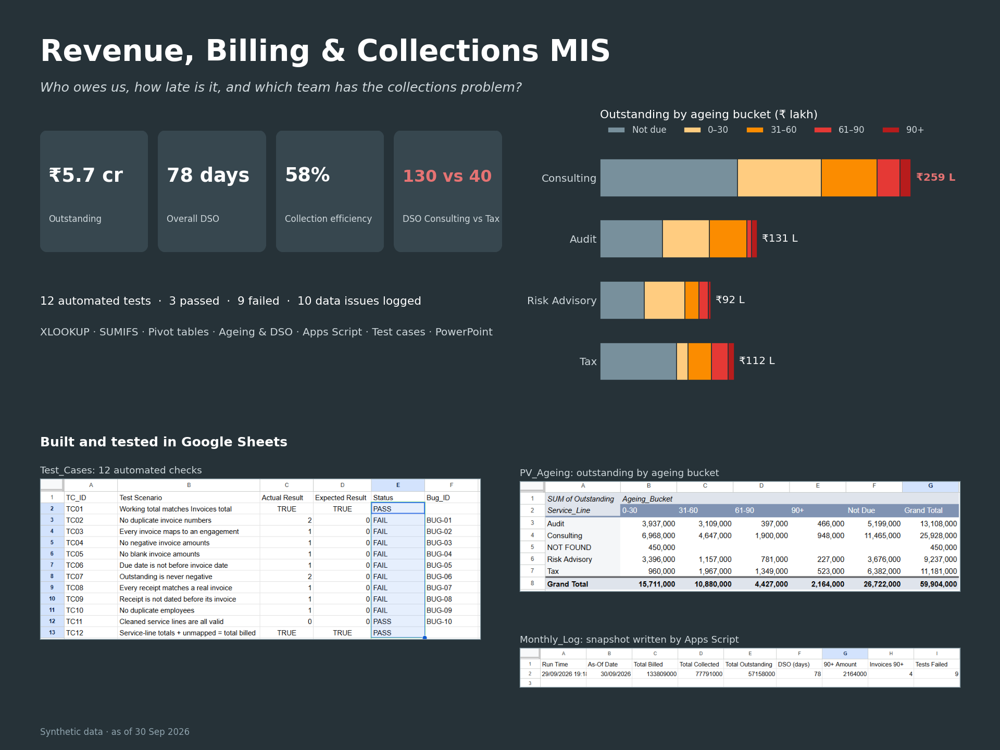
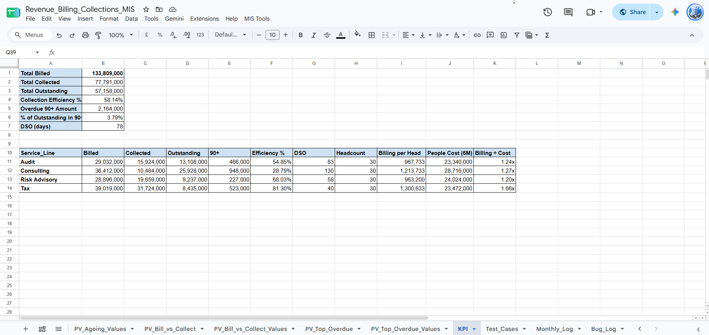
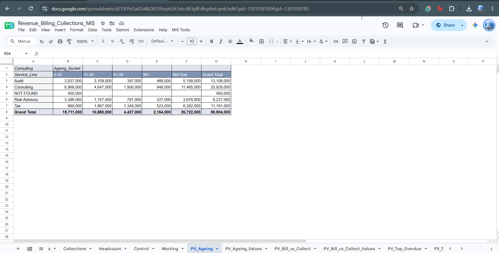
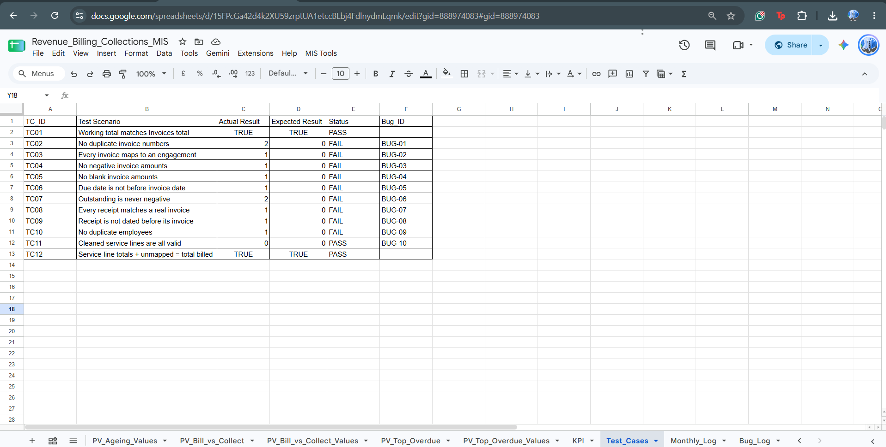
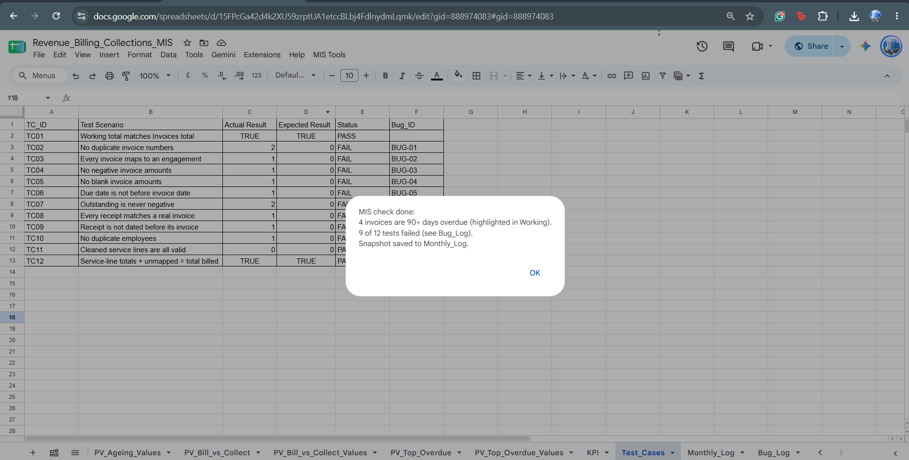

# Revenue, Billing & Collections MIS



**Google Sheets · XLOOKUP · SUMIFS · Pivot Tables · Apps Script · Test Cases · PowerPoint**

A monthly MIS (management information system) report for a professional-services firm: it tracks what was billed, what was collected, how late clients are paying, and whether the underlying data can be trusted, then summarises it in a 5-slide leadership briefing.

🔗 **Live Google Sheet (view only):** https://docs.google.com/spreadsheets/d/15FPcGa42d4k2XU59zrptUA1etccBLbj4FdlnydmLqmk/edit?usp=sharing
📊 **Leadership deck:** [`deck/Collections_MIS_Leadership_Briefing.pptx`](deck/)

> **Data note:** All data is **synthetic**, generated to mimic a professional-services firm (40 engagements, 168 invoices, 96 receipts, 121 employee records, Apr–Sep 2026). Eleven data-quality errors were deliberately planted to test the validation layer. No real company or client data is used.

---

## Business question

> *Who owes us money, how much, how late is it, and which team has the biggest collections problem?*

## Key findings (as of 30 Sep 2026)

| Metric | Result |
|---|---|
| Total billed | ₹13.4 crore |
| Total outstanding | ₹5.7 crore |
| Collection efficiency | 58% |
| Overall DSO | 78 days |

1. **Consulting is tying up cash.** DSO of **130 days** vs **40 days** for Tax; only ~29% of Consulting billing has been collected.
2. **Earning isn't the problem, collecting is.** Consulting bills 1.27x its people cost, in line with other teams, but converts the least into cash, which is a working-capital issue.
3. **Five clients hold ~64% of all 60+ day overdue money.** Granite Energy (₹12.6 lakh) is the first account to chase.
4. **Data quality:** 12 automated checks, 3 passed, 9 failed; 10 issues logged, 8 still open for Finance to resolve.

---

## How the workbook is built

| Tab | Purpose |
|---|---|
| `Engagement_Master`, `Invoices`, `Collections`, `Headcount` | Raw data (imported CSVs) |
| `Control` | Report as-of date and period length, so results don't change daily |
| `Working` | One row per invoice: XLOOKUP for client / service line / partner, SUMIFS for amount received (handles partial payments), outstanding, days overdue, ageing bucket |
| `PV_Ageing`, `PV_Bill_vs_Collect`, `PV_Top_Overdue` | Pivot tables: ageing by service line, billed vs collected, chase list |
| `KPI` | Collection efficiency, DSO, 90+ exposure, and per-service-line headcount, billing per head, billing ÷ people cost |
| `Test_Cases` | 12 formula-driven tests with expected vs actual results and PASS/FAIL |
| `Bug_Log` | Each failure logged with record, severity, impact on the report, recommended fix and status |
| `Monthly_Log` | Timestamped KPI snapshots written by the Apps Script |

### Key definitions

- **Outstanding** = invoice amount − all receipts against that invoice
- **Ageing buckets** = Paid, Not Due, 0–30, 31–60, 61–90, 90+ days past due date
- **Collection efficiency** = collected ÷ billed
- **DSO (days sales outstanding)** = outstanding ÷ billed × days in period (183)

### Data validation

Errors are **flagged, not deleted**, so the report stays auditable. Examples found:

| Issue | Severity | Status |
|---|---|---|
| ₹11.4 lakh received against an invoice with a blank amount | High | Open |
| ₹4.5 lakh invoice linked to an engagement that doesn't exist | High | Open |
| ₹3.0 lakh receipt against a non-existent invoice | High | Open |
| ₹2.5 lakh overpayment on one invoice | High | Open |
| Duplicate employee record | Medium | Handled in MIS (excluded via duplicate check) |
| Inconsistent service-line text (`consulting `, `Risk advisory`) | Low | Handled in MIS (TRIM + PROPER) |

"Open" issues need Finance or the client to confirm the correct value; the analyst reports them rather than guessing.

### Automation (Apps Script)

A custom **MIS Tools** menu runs a one-click monthly check that:
1. highlights invoices 90+ days overdue,
2. counts failed test cases,
3. appends a timestamped KPI snapshot to `Monthly_Log`,
4. shows a summary pop-up.

The script is restricted to the current spreadsheet (`@OnlyCurrentDoc`) for least-privilege access.

---

## Screenshots

| KPI summary | Ageing pivot and chart |
|---|---|
|  |  |

| Test cases | One-click MIS check |
|---|---|
|  |  |

## Repository structure

```
├── README.md
├── data/          raw CSVs (synthetic) + answer key of planted errors
├── workbook/      Excel export of the Google Sheet
├── apps-script/   mis_tools.gs
├── testing/       Test_Cases and Bug_Log exports
├── deck/          5-slide leadership briefing (.pptx + PDF)
└── screenshots/   dashboard, pivots, script run, test results
```

## Notes

- The Excel export keeps all formulas; XLOOKUP and IFS need Excel 2021 or Microsoft 365.
- Pivot tables are live in the Google Sheet; the Excel export includes value copies in the `_Values` tabs.
- The Apps Script menu runs only in the live Google Sheet.
- In a corporate environment the same logic would be built in Excel (VBA or Office Scripts) and run only on firm systems.
- Built with AI assistance (Claude) for synthetic data generation, script drafting and deck production; all analysis steps, formulas and tests were built and verified in the workbook.
